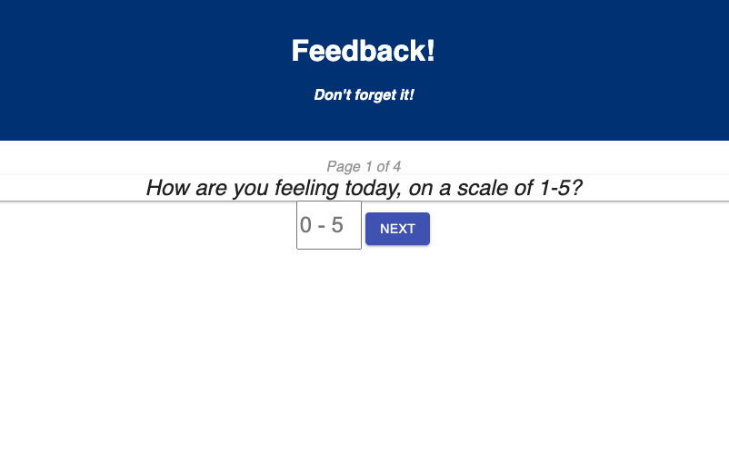
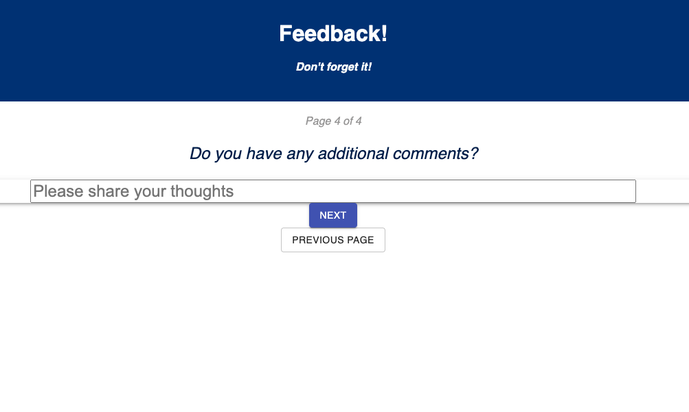
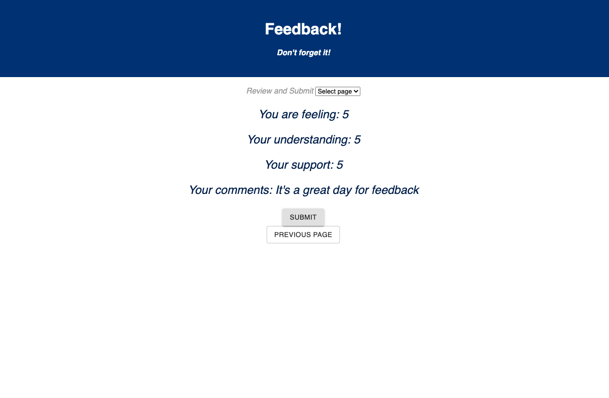

# Proth Weekend Feeback Survey Challenge

Created a 4-page survey for gathering feedback, with a review page for submission, and redirect back to the start.

## Description

__Duration: 2-day sprint__

Before beginning the project, I thought through the data pathways and used a visual chart to help flesh out my thoughts 
[LucidChart](https://lucid.app/lucidchart/938a8683-1062-4b0d-a7f4-cedf301ba500/edit?view_items=VrncJSMH1AkJ&invitationId=inv_e9026113-ea6a-45ce-b2ce-f65ed9d0c22a)

Below is an example of the code I wrote for a component page to leave feedback, four of which were used in the app, in additions to others.

``` // Check out this code 
 
    function IsSupported () {

    const history = useHistory();
    const dispatch = useDispatch();
    const [supportNumber, setSupptorNumber] = useState('');

    const handleClick = () => {
        if (supportNumber === '') {
            alert ('enter a number');
            return
        }
        dispatch({
            type: 'SUPPORTED_FEEDBACK',
            payload: supportNumber,
        })
        history.push('/comment');
    }

    return (
        <>
        <p>How well supported are you, on a scale of 1-5?</p>
        <input required 
                type="number"
                placeholder="0 - 5"
                value={supportNumber}
                onChange={ (event) => setSupptorNumber(event.target.value) }
        />
        <button onClick={ handleClick }>Next</button>
        </>
    )
}
```

## Screen Shots

Here's what page one looks like:


And the comment page: 


And the review page:


### Prerequisites

Link to software that is required to install the app (e.g. node).

- [Node.js](https://nodejs.org/en/)

## Installation

1. Create a database named `prime_feedback`,
2. The queries in the `data.sql` file are set up to create all the necessary tables and populate the needed data to allow the application to run correctly. The project is built on [Postgres](https://www.postgresql.org/download/), so you will need to make sure to have that installed. We recommend using Postico to run those queries as that was used to create the queries, 
3. Open up your editor of choice and run an `npm install`
4. Run `npm run server` in your terminal
5. Run `npm run client` in your terminal
6. The `npm run client` command will open up a new browser tab for you!

## Usage
The home page of this app is the first page of the feedback form:

1. Select a number in the input field between 0 and 5
2. Click 'Next'
3. Complete the next two pages in the same way
4. On page 4, write any additional comments you may have
5. Click 'Next'
6. Review your answers, and click submit
7. You are brought to a landging page where you may select 'Start Over' to fill out a new feedback form


## Built With

__TO DO: get links__
- [React]
- [Redux]
- [Express]
- [Axios]
- [logger]
- [Postgresql]

## License
[MIT](https://choosealicense.com/licenses/mit/)

_Note, include this only if you have a license file. GitHub will generate one for you if you want!_

## Acknowledgement
Thanks to [Prime Digital Academy](www.primeacademy.io) who equipped and helped me to make this application a reality. Thanks to my classmates from the Proth cohort. Thanks to my wife who supported me as I learned and wrote this code

## Support
If you have suggestions or issues, please email me at [gregtambornino@gmail.com](www.google.com)

